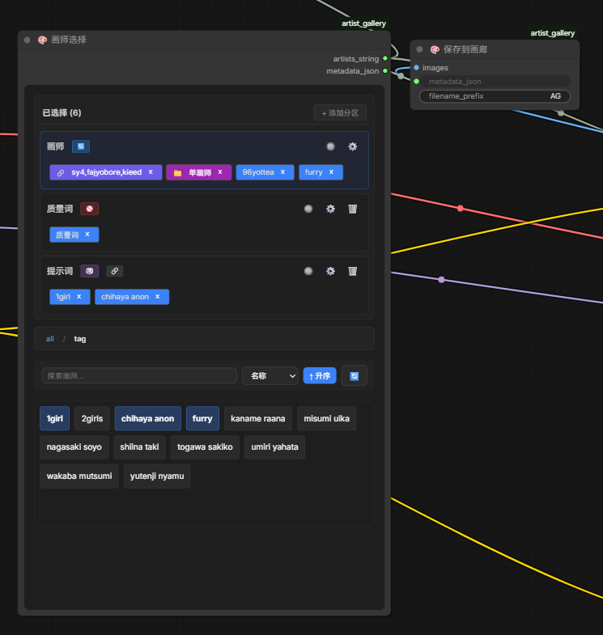
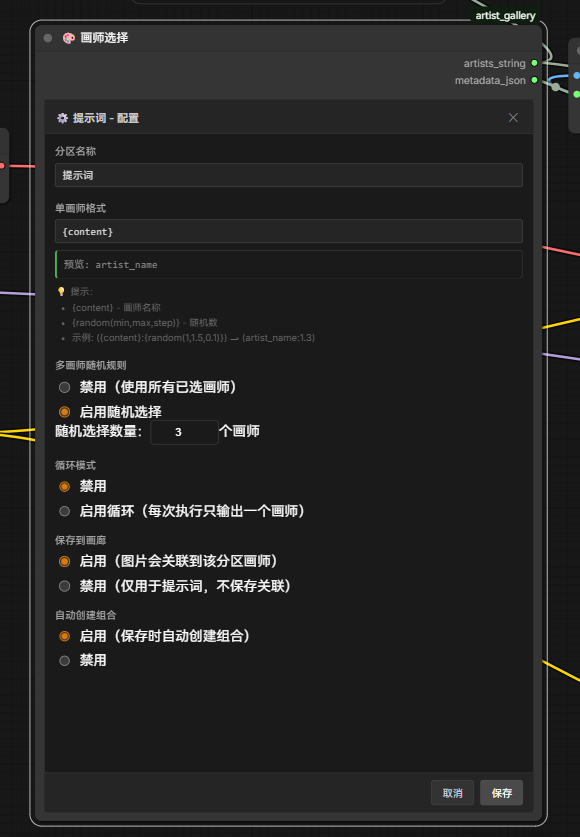
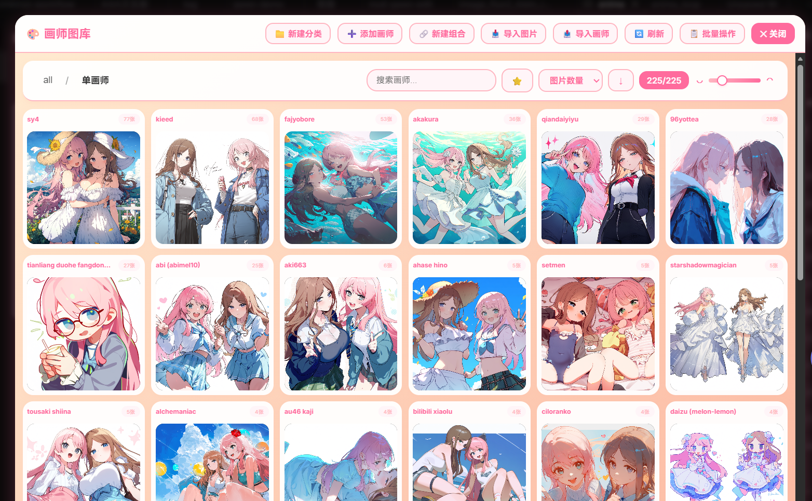

# Prompt Gallery for ComfyUI

用于管理 Prompt、选择 Prompt、保存生成图片和浏览历史图片的 ComfyUI 自定义节点插件。

交流与问题反馈：QQ群 `1082160486`





## 主要功能

- 按分类管理 Prompt，支持搜索、封面与批量操作
- 在工作流中通过分区选择 Prompt，支持排序、权重、随机、循环和输出格式
- 保存生成图片，并记录 `prompt_string`、工作流和图片元数据
- 按分类读取 Prompt，或将工作流中的文本快速保存为 Prompt
- 浏览历史图片，支持日期、自定义字段、搜索和过滤
- 导入本地图片、ComfyUI 历史输出或 ZIP 数据包，并支持导出
- 图片详情支持复制工作流、复制 API Prompt 和基础图片编辑

## 安装

在 ComfyUI 的 `custom_nodes` 目录执行：

```bash
git clone https://github.com/Lotus0614/ComfyUI-Prompt-Gallery.git
```

安装依赖：

```bash
cd ComfyUI-Prompt-Gallery
pip install -r requirements.txt
```

Windows 便携版可使用 ComfyUI 自带的 Python：

```powershell
..\..\python_embeded\python.exe -m pip install -r requirements.txt
```

安装完成后重启 ComfyUI，并强制刷新浏览器页面。节点搜索中应能看到：

- `Prompt选择`
- `保存到画廊`
- `快速保存Prompt`
- `从分类读取Prompt`

## 快速上手

1. 点击 ComfyUI 页面右下角的画廊悬浮按钮。
2. 创建分类，并添加常用 Prompt。
3. 在工作流中添加 `Prompt选择`，选择需要输出的 Prompt。
4. 将 `prompts_string` 接入提示词链路。
5. 需要保存图片时，添加 `保存到画廊`，连接 `images` 和 `prompt_string`。

`prompt_string` 必须连接。图片会先完成磁盘保存，索引登记、Prompt 匹配和缺失封面设置在后台执行，不阻塞工作流返回。

## 节点说明

### Prompt选择

在节点界面中选择 Prompt 或分类，并按分区组织输出。

点击节点浏览栏中的画廊按钮，可打开精简选择画廊。Prompt 和分类会显示当前选择状态；单击可即时选择或取消，双击分类可进入分类。该模式不提供编辑、删除、历史图片、设置或图片详情功能。

输出：

- `prompts_string`：处理格式、权重、随机或循环规则后的 Prompt 文本
- `metadata_json`：当前选择和分区配置的元数据

每个分区可设置输出格式，其中：

- `{content}` 表示 Prompt 内容
- `{random(min,max,step)}` 表示指定范围内的随机数

例如 `({content}:{random(0.8,1.2,0.1)})`。

### 保存到画廊

将生成图片保存到 ComfyUI 的 `output` 目录。

输入：

- `images`：必填，待保存的图片
- `prompt_string`：必填，写入图片索引，并在后台匹配已有 Prompt
- `prefix`：可选，目录和文件名前缀，默认 `prompt_gallery/AG`

`prefix` 的最后一段是文件名前缀，前面的部分是相对 `output` 的目录；目录和文件名前缀均支持 `strftime` 时间格式。

示例：

| `prefix` | 保存结果示例 |
| --- | --- |
| `prompt_gallery/AG` | `output/prompt_gallery/AG_1752724800000_0.png` |
| `gallery/%Y/%m/portrait` | `output/gallery/2026/07/portrait_1752724800000_0.png` |
| `AG` | `output/AG_1752724800000_0.png` |

文件名中的时间戳在同一次批量保存中相同，末尾序号从 `0` 开始。

保存完成后，插件会根据 Prompt 的 `value` 和别名在 `prompt_string` 中做字符串包含匹配。匹配到的 Prompt 如果没有封面，会使用本批次第一张图片作为封面；未匹配到 Prompt 不影响图片保存。

### 快速保存Prompt

将工作流中的文本保存到指定分类：

- `prompt_name`：显示名称
- `category`：目标分类
- `prompt_value`：必填的 Prompt 内容

同一分类下存在同名 Prompt 时更新内容，否则创建新 Prompt。保存操作在后台执行。

### 从分类读取Prompt

读取指定分类及其子分类中的 Prompt，并拼接为字符串。

- `property`：读取 `value` 或 `name`
- `mode`：全部、最新 N 个、最旧 N 个或随机 N 个
- `count`：N 的数量
- `separator`：输出分隔符

## 图库使用

图库中可以管理分类和 Prompt，也可以进行以下操作：

- `导入图片`：向当前图库、分类或 Prompt 登记本地图片
- `导入输出图片`：扫描 ComfyUI `output` 目录并实时显示导入进度
- `导入`：导入插件导出的 ZIP 数据包
- 历史视图：按日期或自定义字段分组浏览全部已登记图片
- 图片详情：查看元数据，复制工作流或 API Prompt，并使用画笔、马赛克等编辑工具

图片编辑仅作用于当前预览，不会修改原图片文件。

需要自行制作 ZIP 导入包时，请参考 [IMPORT_FORMAT.md](IMPORT_FORMAT.md)。

## 封面维护

新建 Prompt 时会尝试使用最新匹配图片作为封面；保存到画廊或导入图片时，也会为没有封面的 Prompt 设置封面。

历史数据没有封面时，可在 `设置 > 图库设置 > 自动匹配封面` 中手动扫描。该操作不会覆盖已有封面；数据量较大时可能需要等待一段时间。

`pyahocorasick` 用于加速这类批量匹配，已包含在 `requirements.txt` 中。

## 数据位置

- 图片文件：ComfyUI 的 `output` 目录，具体子目录由 `SaveToGallery.prefix` 决定
- 图库数据：ComfyUI 的 `user/default/prompt_gallery` 目录

升级或迁移 ComfyUI 前，建议备份上述数据目录和需要保留的图片文件。

## 常见问题

### 页面没有画廊按钮或节点

确认插件目录位于 `ComfyUI/custom_nodes`，依赖安装在 ComfyUI 实际使用的 Python 环境中。随后重启 ComfyUI，并强制刷新浏览器缓存。

### 保存节点提示必须连接 prompt_string

`prompt_string` 是必填输入。可连接 `Prompt选择` 的 `prompts_string`，也可连接其他包含最终 Prompt 文本的字符串输出。

### 图片已保存，但图库暂时没有显示

图片索引在后台写入，短时间内刷新一次图库即可。也请确认 `prefix` 指向 ComfyUI `output` 目录下的有效相对路径。

### 历史图片没有封面

打开 `设置 > 图库设置`，执行一次 `自动匹配封面`。它只处理当前没有封面的 Prompt。

### 更新后前端仍是旧界面

重启 ComfyUI 后对页面执行强制刷新。浏览器仍使用旧资源时，清理站点缓存后重新打开。
